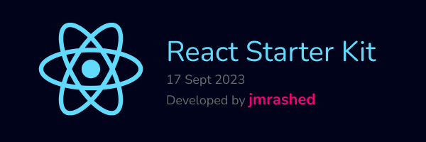

# React Starter Kit
The web's most popular Jamstack front-end template for building web applications with React.

## Features

- Optimized for serverless deployment to CDN edge locations (Cloudflare Workers)
- HTML page rendering (SSR) at CDN edge locations, all ~100 points on Lighthouse
- Hot module replacement during local development using React Refetch
- Pre-configured with CSS-in-JS styling using Emotion.js
- Pre-configured with code quality tools: ESLint, Prettier, TypeScript, Vitest, etc.
- Pre-configured with VSCode code snippets and other VSCode settings


## Directory Structure

`├──`[`.github`](.github) — GitHub configuration including CI/CD workflows<br>
`├──`[`.vscode`](.vscode) — VSCode settings including code snippets, recommended extensions etc.<br>
`├──`[`app`](./app) — Web application front-end built with [React](https://react.dev/) and [Material UI](https://mui.com/core/)<br>
`├──`[`edge`](./edge) — Cloudflare Workers (CDN) edge endpoint<br>
`├──`[`env`](./env) — Application settings, API keys, etc.<br>
`├──`[`scripts`](./scripts) — Automation scripts such as `yarn deploy`<br>
`├──`[`tsconfig.base.json`](./tsconfig.base.json) — The common/shared TypeScript configuration<br>
`└──`[`tsconfig.json`](./tsconfig.json) — The root TypeScript configuration<br>

## Tech Stack

- [React](https://react.dev/), [React Router](https://reactrouter.com/), [Recoil](https://recoiljs.org/), [Emotion](https://emotion.sh/), [Material UI](https://next.material-ui.com/), [Firebase Authentication](https://firebase.google.com/docs/auth)
- [Cloudflare Workers](https://workers.cloudflare.com/), [Vite](https://vitejs.dev/), [Vitest](https://vitejs.dev/),
  [TypeScript](https://www.typescriptlang.org/), [ESLint](https://eslint.org/), [Prettier](https://prettier.io/), [Yarn](https://yarnpkg.com/) with PnP

## Requirements

- [Node.js](https://nodejs.org/) v18+ with [Corepack](https://nodejs.org/api/corepack.html) (`$ corepack enable`)
- [VS Code](https://code.visualstudio.com/) editor with [recommended extensions](.vscode/extensions.json)
- Optionally [React Developer Tools](https://chrome.google.com/webstore/detail/react-developer-tools/fmkadmapgofadopljbjfkapdkoienihi?hl=en)
  and [Reactime](https://chrome.google.com/webstore/detail/reactime/cgibknllccemdnfhfpmjhffpjfeidjga?hl=en) browser extensions

## Getting Started

[Generate](https://github.com/jmrashed/react-starter-kit/generate) a new project
from this template, clone it, install project dependencies, update the
environment variables found in [`env/*.env`](./env/), and start hacking:

```
$ git clone https://github.com/jmrashed/react-starter-kit.git example
$ cd ./example
$ yarn install
$ yarn start
```

The app will become available at [http://localhost:5173/](http://localhost:5173/) (press `q` key to exit).

**IMPORTANT**: Ensure that VSCode is using the workspace [version of TypeScript](https://code.visualstudio.com/docs/typescript/typescript-compiling#_using-newer-typescript-versions)
and ESLint.


## Scripts

- `yarn start` — Launches the app in development mode on [`http://localhost:5173/`](http://localhost:5173/)
- `yarn build` — Compiles and bundles the app for deployment
- `yarn lint` — Validate the code using ESLint
- `yarn tsc` — Validate the code using TypeScript compiler
- `yarn test` — Run unit tests with Vitest, Supertest
- `yarn edge deploy` — Deploys the app to Cloudflare

## How to Deploy

Ensure that all the environment variables for the target deployment environment
(`test`, `prod`) found in [`/env/*.env`](./env/) files are up-to-date.

If you haven't done it already, push any secret values you may need to CF Workers
environment by running `yarn workspace edge wrangler secret put <NAME> [--env #0]`.

Finally build and deploy the app by running:

```
$ yarn build
$ yarn deploy [--env #0] [--version #0]
```

Where `--env` argument is the target deployment area, e.g. `yarn deploy --env=prod`.

## How to Update

- `yarn set version latest` — Bump Yarn to the latest version
- `yarn upgrade-interactive` — Update Node.js modules (dependencies)
- `yarn dlx @yarnpkg/sdks vscode` — Update TypeScript, ESLint, and Prettier settings in VSCode

## Contributors 👨‍💻
 

## Backers 💰

 

## Related Projects

 

## How to Contribute

Anyone and everyone is welcome to [contribute](.github/CONTRIBUTING.md). Start
by checking out the list of [open issues](https://github.com/jmrashed/react-starter-kit/issues)
marked [help wanted](https://github.com/jmrashed/react-starter-kit/issues?q=label:"help+wanted").
However, if you decide to get involved, please take a moment to review the
[guidelines](.github/CONTRIBUTING.md).

## License

Copyright © 2014-present Jmrashed. This source code is licensed under the MIT license found in the
[LICENSE](https://github.com/jmrashed/react-starter-kit/blob/main/LICENSE) file.
 